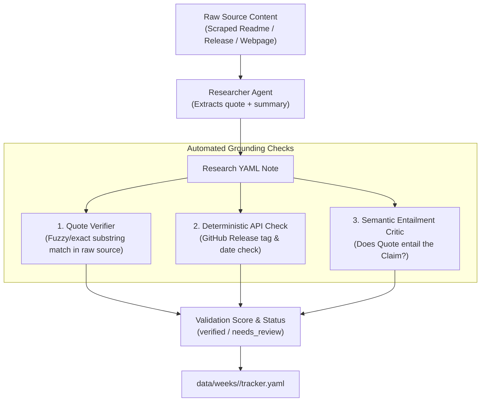

# Editorial Governance, Provenance & Grounding Validation

## 1. Overview & Core Philosophy

As the CNCF Landscape A-to-Z project scales to cover hundreds of cloud native projects, maintaining high factual accuracy, consistent voice, and verifiable technical detail is essential.

### 1.1 Target Content vs. Intermediate Artifacts

In this architecture, content is strictly divided between **target publications** and **intermediate working artifacts**:

```
┌────────────────────────────────────────────────────────────────────────┐
│                        UPSTREAM & RESEARCH                             │
│                                                                        │
│  CNCF Landscape API / GitHub / Docs                                    │
│        ↓ (Extraction & Scraping)                                       │
│  Research YAMLs (data/weeks/<WEEK_ID>/research/<tool>.yaml)            │
│  👉 Role: Structured Note-Taking (Agent Working Memory)                │
└───────────────────────────────────┬────────────────────────────────────┘
                                    │
                  ┌─────────────────┴─────────────────┐
                  ▼                                   ▼
┌───────────────────────────────────┐ ┌───────────────────────────────────┐
│     TARGET 1: TOOL PAGES          │ │     TARGET 2: BLOG POSTS          │
│  website/content/tools/<tool>.md  │ │ website/content/posts/<year>-<w>.md│
│                                   │ │                                   │
│ • Comprehensive single-tool page  │ │ • Editorial weekly narrative      │
│ • Specs, features, quickstarts    │ │ • Project highlights & discovery  │
│ • Grounded directly in notes      │ │ • Direct inline source links      │
└───────────────────────────────────┘ └───────────────────────────────────┘
```

- **Target 1: Tool Pages (`website/content/tools/*.md`)**: The primary reference pages for individual landscape projects. They contain full feature breakdowns, installation guides, repository links, and use cases.
- **Target 2: Weekly Blog Posts (`website/content/posts/*.md`)**: Curated editorial roundups summarizing the week's projects for readers.
- **Intermediate: Research YAMLs (`data/weeks/<WEEK_ID>/research/*.yaml`)**: **Structured note-taking**. These files are not meant as standalone end-user publications. Instead, they serve as the verified evidence store and bridge between raw web data and generated content.

---

## 2. Provenance & Source Grounding Strategy

To guarantee that generated tool pages and blog posts are accurate, we mandate that **agents actually derive their claims from verified sources rather than hallucinating from parametric memory**.

### 2.1 Note-Taking Schema with Quote-Based Grounding

Research notes should capture multiple high-authority sources (the more sources, the better). Each source must include exact quotes/snippets:

```yaml
# Example: data/weeks/00-A/research/aibrix.yaml
project_name: "AIBrix"

# Governance & Verification Metadata
governance:
  researched_at: "2026-09-20T19:30:00Z"
  agent: "researcher"
  model: "gemini-2.5-flash"
  grounding_status: "verified" # [verified, needs_review, failed]
  grounding_score: 0.95

# Multi-Source Evidence Capture (Note-Taking)
sources:
  - id: "src_github_readme"
    url: "https://github.com/vllm-project/aibrix"
    source_type: "github_readme"
    retrieved_at: "2026-09-20T19:28:10Z"
    quotes:
      - "AIBrix is an open-source, cost-efficient, scalable and pluggable cloud-native infrastructure for GenAI applications."
      - "Tailored specifically to enterprise needs for deploying, managing, and scaling large language model (LLM) inference."
  - id: "src_github_releases"
    url: "https://github.com/vllm-project/aibrix/releases/tag/v0.7.0"
    source_type: "github_release"
    retrieved_at: "2026-09-20T19:28:15Z"
    quotes:
      - "v0.7.0: Management Console, Self-Hosted Batch, KV-Centric Disaggregation, and High-Availability Gateway."

# Structured Synthesized Notes (Grounded in Sources)
summary: "AIBrix is an open-source, cost-efficient cloud-native infrastructure for deploying and scaling LLM inference in enterprise Kubernetes environments."
summary_sources: ["src_github_readme"]

key_features:
  - text: "High-Density LoRA Management for streamlined low-rank adaptation support."
    source_id: "src_github_readme"
  - text: "Unified AI Runtime sidecar enabling standardized metrics and model downloads."
    source_id: "src_github_readme"
  - text: "KV-Centric Disaggregation and Management Console introduced in v0.7.0."
    source_id: "src_github_releases"

recent_updates:
  latest_version: "v0.7.0"
  release_date: "2026-06-16"
  highlights: "Introduced Management Console, Self-Hosted Batch, and HA Gateway."
  source_id: "src_github_releases"

use_cases: "Optimizing GenAI inference on Kubernetes for cost efficiency and high-density multi-tenant serving."
get_started: "kubectl apply -k https://github.com/vllm-project/aibrix/config/default"
related_tools:
  - "vLLM"
  - "KServe"
```

---

## 3. Architectural Decision: Avoiding a Vector Database for Now

### 3.1 Design Choice
We intentionally do **not** introduce an external source database or vector store (e.g., Pinecone, Qdrant, Chroma, Milvus) at this stage.

### 3.2 Rationale
1. **Self-Contained & Git-Native**: Storing structured research notes directly in Git alongside ETL and website markdown keeps all artifacts transparent, diffable, and inspectable in standard pull requests.
2. **Deterministic Reproducibility**: Research files in `data/weeks/<WEEK_ID>/research/` can be audited by humans without setting up database connections or managing external vector store state.
3. **Low Operational Overhead**: Eliminates extra services, vector indexing infrastructure, embedding API costs, and synchronization lag in CI/CD pipelines.

### 3.3 Future Evolution Path
As the corpus grows across thousands of landscape entries and cross-project relationship querying becomes necessary, we can evaluate a lightweight, embedded vector store (such as **LanceDB** or **DuckDB with VSS**) or a retrieval index as a future enhancement.

---

## 4. Grounding Validation Without a Vector Store

How do we ensure the agent is actually deriving content from the cited sources without a complex vector database?



### 4.1 Three-Layer Grounding Verification

1. **Quote Verification (Substring / Fuzzy Matching)**:
   - When the researcher scrapes a web page or fetches a GitHub README, the validator checks that the text in `quotes:` is an exact or near-exact substring of the raw source payload.
   - If an agent invents a "quote" that does not exist in the source URL, the note fails validation immediately.

2. **Deterministic API Cross-Verification**:
   - For version numbers, release dates, and repository stars, automated scripts verify directly against GitHub APIs and the CNCF landscape dataset.

3. **Claim-to-Quote Semantic Entailment**:
   - A lightweight validation prompt (or NLI model) checks whether the synthesized bullet points logically follow from the recorded quotes:
     - **Entailment**: Claim is fully justified by the quote.
     - **Extrapolation/Hallucination**: Claim adds unsubstantiated facts.
     - **Contradiction**: Claim conflicts with the quote.

---

## 5. Editorial Governance & Human-in-the-Loop (HITL) Workflow

Editorial governance ensures that humans retain oversight over published tool pages and weekly blog posts while agents automate the repetitive drafting.

### 5.1 Tracker Integration

Task tracking in `data/weeks/<WEEK_ID>/tracker.yaml` incorporates governance statuses:

```yaml
AIBrix:
  tasks:
    research:
      status: completed
      grounding_status: verified     # [verified | needs_review | failed]
      grounding_score: 0.95
      output_file: data/weeks/00-A/research/aibrix.yaml
    content:
      status: completed
      output_file: website/content/tools/aibrix.md
```

### 5.2 Exception-Based Human Review in Pull Requests

1. **Automated CI Audit**:
   - On PR creation, a CI action validates all research YAMLs and generated tool/blog pages.
   - PR comment publishes an **Editorial Health Report**:
     - 🟢 **96% of claims verified against raw source quotes**
     - 🟡 **2 items flagged for human editorial review** (e.g. unverified release date or low entailment score)
     - 🔴 **0 dead source links**

2. **Human Editorial Sign-Off**:
   - Human editors focus their attention on flagged items.
   - Editors can edit the research YAML notes or update the markdown directly before merging.

---

## 6. Downstream Content Synthesis: Tool Pages & Blog Posts

When the Writer Agent generates the final publications:

1. **Tool Pages (`website/content/tools/*.md`)**:
   - Populated from research notes with structured metadata (features, installation commands, use cases).
   - Direct link attribution to official docs and repositories.

2. **Weekly Blog Posts (`website/content/posts/*.md`)**:
   - Narrative synthesis prioritizing new projects, notable updates, and category trends.
   - High-level summaries cross-link to individual tool pages and cite verified sources.

---

## 7. Roadmap & Future Explorations

| Phase | Focus | Status |
|---|---|---|
| **Phase 1: Core Automation** | Deterministic ETL + Graph Orchestration + Tracker YAML | ✅ Completed |
| **Phase 2: Structured Note-Taking** | Multi-source research schema with verbatim quotes | 🔄 In Progress |
| **Phase 3: Automated Grounding CI** | Deterministic quote-matching + GitHub API validation | 📅 Planned |
| **Phase 4: Embedded Retrieval Store** | Optional local vector store (LanceDB / DuckDB) for cross-project search | 💡 Future Exploration |
