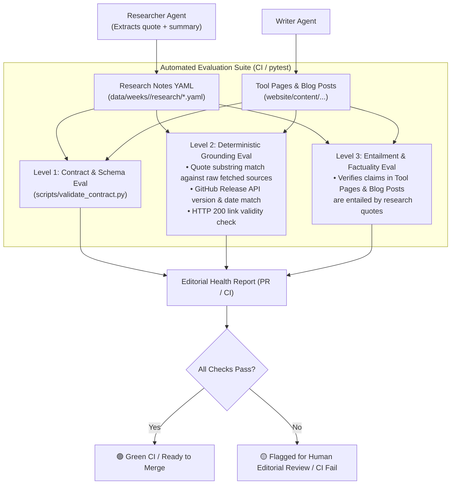

# Editorial Governance, Provenance & Grounding Evaluation Framework

## 1. Overview & Core Philosophy

As the CNCF Landscape A-to-Z project scales to cover hundreds of cloud native projects, maintaining high factual accuracy, consistent voice, and verifiable technical detail is essential.

### 1.1 Target Content vs. Intermediate Artifacts

In this architecture, content is strictly divided between **target publications** and **intermediate working artifacts**:

```
┌────────────────────────────────────────────────────────────────────────┐
│                        UPSTREAM & RESEARCH                             │
│                                                                        │
│  CNCF Landscape API / GitHub / Official Docs                           │
│        ↓ (Extraction & Scraping)                                       │
│  Research YAMLs (data/weeks/<WEEK_ID>/research/<tool>.yaml)            │
│  👉 Role: Structured Note-Taking (Agent Working Memory)                │
└───────────────────────────────────┬────────────────────────────────────┘
                                    │
                  ┌─────────────────┴─────────────────┐
                  ▼                                   ▼
┌───────────────────────────────────┐ ┌───────────────────────────────────┐
│     TARGET 1: TOOL PAGES          │ │     TARGET 2: BLOG POSTS          │
│  website/content/tools/<tool>.md  │ │ website/content/posts/<year>-<w>.md│
│                                   │ │                                   │
│ • Comprehensive single-tool page  │ │ • Editorial weekly narrative      │
│ • Specs, features, quickstarts    │ │ • Project highlights & discovery  │
│ • Grounded directly in notes      │ │ • Direct inline source links      │
└───────────────────────────────────┘ └───────────────────────────────────┘
```

- **Target 1: Tool Pages (`website/content/tools/*.md`)**: The primary reference pages for individual landscape projects (features, specs, quickstart, use cases).
- **Target 2: Weekly Blog Posts (`website/content/posts/*.md`)**: Curated editorial roundups summarizing the week's projects for readers.
- **Intermediate: Research YAMLs (`data/weeks/<WEEK_ID>/research/*.yaml`)**: **Structured note-taking**. These files are not meant as standalone end-user publications. Instead, they serve as the verified evidence store and bridge between raw web data and generated content.

---

## 2. Provenance & Source Grounding Strategy

To guarantee that generated tool pages and blog posts are accurate, agents must **derive their claims from verified sources rather than hallucinating from parametric memory**.

### 2.1 Note-Taking Schema with Quote-Based Grounding

Research notes capture multiple high-authority sources (the more sources, the better). Each source includes verbatim quotes/snippets.

> [!IMPORTANT]
> **No Self-Reported Metrics in Notes or Tracker**: Research YAMLs and `tracker.yaml` do **not** contain self-reported LLM confidence scores (e.g. `grounding_score: 0.98`), as hallucinating models will also hallucinate high confidence. All evaluations are performed externally by the automated evaluation suite.

```yaml
# Example: data/weeks/00-A/research/aibrix.yaml
project_name: "AIBrix"
homepage_url: "https://aibrix.io"
repo_url: "https://github.com/vllm-project/aibrix"
docs_url: "https://aibrix.io/docs"
cncf_status: "sandbox" # sandbox | incubating | graduated | member

latest_release:
  version: "v0.7.0"
  date: "2026-06-16"
  release_notes_url: "https://github.com/vllm-project/aibrix/releases/tag/v0.7.0"

# Multi-Source Evidence Capture (Verbatim Quotes)
sources:
  - id: "src_github_readme"
    title: "AIBrix GitHub README"
    url: "https://github.com/vllm-project/aibrix"
    source_type: "github_readme"
    quotes:
      - "AIBrix is an open-source, cost-efficient, scalable and pluggable cloud-native infrastructure for GenAI applications."
      - "Tailored specifically to enterprise needs for deploying, managing, and scaling large language model (LLM) inference."
  - id: "src_github_releases"
    title: "AIBrix v0.7.0 Release Notes"
    url: "https://github.com/vllm-project/aibrix/releases/tag/v0.7.0"
    source_type: "github_release"
    quotes:
      - "v0.7.0: Management Console, Self-Hosted Batch, KV-Centric Disaggregation, and High-Availability Gateway."

# Synthesized Working Notes (Grounded in Sources)
summary: "AIBrix is an open-source, cost-efficient cloud-native infrastructure for deploying and scaling LLM inference in enterprise Kubernetes environments."
key_features:
  - "High-Density LoRA Management for streamlined low-rank adaptation support."
  - "Unified AI Runtime sidecar enabling standardized metrics and model downloads."
  - "KV-Centric Disaggregation and Management Console introduced in v0.7.0."
recent_updates: "v0.7.0 introduced Management Console, Self-Hosted Batch, and HA Gateway."
use_cases: "Optimizing GenAI inference on Kubernetes for cost efficiency and high-density multi-tenant serving."
ecosystem_perspectives:
  strengths: "Deep Kubernetes-native integration with vLLM and high-density multi-model serving."
  considerations: "Rapidly evolving API as a sandbox project."
  community_discussions:
    - "KubeCon keynote collaboration with Google on LLM-aware Kubernetes load balancing."
get_started: "kubectl apply -k https://github.com/vllm-project/aibrix/config/default"
related_tools:
  - "vLLM"
  - "KServe"
last_researched_at: "2026-09-20T19:30:00Z"
research_version: 1
```

---

## 3. Architectural Decision: Avoiding a Vector Database for Now

### 3.1 Design Choice
We intentionally do **not** introduce an external source database or vector store (e.g., Pinecone, Qdrant, Chroma, Milvus) at this stage.

### 3.2 Rationale
1. **Self-Contained & Git-Native**: Storing structured research notes directly in Git alongside ETL and website markdown keeps all artifacts transparent, diffable, and inspectable in standard pull requests.
2. **Deterministic Reproducibility**: Research files in `data/weeks/<WEEK_ID>/research/` can be audited by humans without setting up database connections or managing external vector store state.
3. **Low Operational Overhead**: Eliminates extra services, vector indexing infrastructure, embedding API costs, and synchronization lag in CI/CD pipelines.

### 3.3 Future Evolution Path
As the corpus grows across thousands of landscape entries and cross-project relationship querying becomes necessary, we can evaluate a lightweight, embedded vector store (such as **LanceDB** or **DuckDB with VSS**) as an optional retrieval enhancement.

---

## 4. Grounding as Part of the Evaluation Framework

Rather than relying on LLMs to self-certify their accuracy, grounding validation is built into the repository's **Automated Evaluation Suite** run in CI and test environments.



### 4.1 Evaluation Suite Levels

| Evaluation Level | Purpose | Mechanism | Execution |
|---|---|---|---|
| **Level 1: Schema & Contract** | Verifies required YAML/MD structure and types | Pydantic model validation (`validate_contract.py`) | Pre-commit / CI |
| **Level 2: Deterministic Grounding** | Verifies quotes and metadata exist in actual upstream sources | Substring matching against fetched raw text + GitHub REST API checks + HTTP status checks | Test suite / CI |
| **Level 3: Claim Entailment** | Verifies tool pages and blog posts do not make unsupported claims | NLI / Entailment check against research note quotes | CI evaluation step |

### 4.2 Core Evaluation Metrics

1. **Quote Grounding Rate**: Percentage of `quotes:` that are exact or fuzzy substrings of the source URL content (Target: 100%).
2. **Deterministic Metadata Accuracy**: Percentage of `latest_release` tags and dates matching the upstream GitHub API (Target: 100%).
### 4.3 Edge-Case Safeguards & Defensive Architecture

To avoid failure modes in production and CI, the evaluation framework and agent workflows incorporate five specific architectural defenses:

1. **Deterministic Local Source Snapshots (Preventing Flaky CI)**:
   - When the Researcher scrapes a web page or README, it saves a raw text snapshot to `data/weeks/<WEEK_ID>/research/.cache/<tool_slug>_<source_id>.txt`.
   - CI validates quotes against this local snapshot offline, eliminating flakiness from upstream website changes, bot-blockers, and unauthenticated rate limits.
   - Live network calls in CI are isolated to a non-blocking HTTP `HEAD` link-liveness test with exponential backoff.

2. **Editorial Lock Protocol (Preventing Human Overwrite / Stomping)**:
   - When an editor manually corrects a research YAML or tool page, the file can be tagged with `editorial_lock: true`.
   - Orchestration agents and batch runners must treat locked files as immutable read-only artifacts unless explicitly passed `--force-unlock`.

3. **Canonical Text Normalization & Domain Glossary**:
   - The quote substring matcher applies canonical text normalization (`html.unescape`, normalizing smart quotes/dashes, and collapsing whitespace) before evaluation.
   - The Tier 1 Entailment Judge prompt injects a standard cloud-native synonym dictionary (`K8s` $\equiv$ `Kubernetes`, `CRD` $\equiv$ `Custom Resource Definition`, `LoRA` $\equiv$ `Low-Rank Adaptation`) to eliminate false-alarm rejections.

4. **Information Compression & Tool Card Projection (Context Window Protection)**:
   - Research schema enforces strict bounding caps (`max 3 sources per tool`, `max 2 quotes per source`, `max 300 chars per quote`).
   - For high-volume weeks (e.g., Week 00-A with 69 items), the orchestrator projects research notes into compact **80-word Tool Cards** (~7,500 tokens total) before passing to the Writer, preventing "Lost-in-the-Middle" degradation.

5. **Graph-Enforced Dependency Order (Preventing 404 Internal Links)**:
   - The dependency graph strictly enforces: $\text{ETL} \rightarrow \text{Research (Notes)} \rightarrow \text{Tool Pages (Content)} \rightarrow \text{Blog Post (Synthesis)}$.
   - Blog posts may only link to `/tools/<slug>/` if the corresponding tool page is already completed.

---

## 5. Separation of Concerns: Tracker vs. Eval Framework

To maintain a clean and reliable architecture, **Task Orchestration** and **Evaluation** are strictly decoupled:

```
┌───────────────────────────────────────────────┐
│ tracker.yaml (Orchestration State Machine)    │
│ • State: PENDING | IN_PROGRESS | COMPLETED    │
│ • Retry counts & timestamps                   │
│ • Output file paths                           │
│ ❌ NO self-reported AI evaluation scores      │
└───────────────────────────────────────────────┘
                       ▲
                       │ (Updated when tests pass or fail)
                       ▼
┌───────────────────────────────────────────────┐
│ Evaluation Framework (CI / Test Suite)        │
│ • Deterministic quote substring verification  │
│ • GitHub API & HTTP 200 link validation       │
│ • PR Editorial Health Audit comment           │
│ ✅ Independent, objective source of truth     │
└───────────────────────────────────────────────┘
```

---

## 6. Editorial Governance & Human-in-the-Loop (HITL) Workflow

1. **Automated CI Audit**:
   - On PR creation, the evaluation suite validates all research YAML notes and generated markdown.
   - Posts an **Editorial Health Report**:
     - 🟢 **100% Schema Contract Valid**
     - 🟢 **All source quotes verified against upstream URLs**
     - 🟢 **Release v0.7.0 verified via GitHub API**
     - 🟢 **0 broken links**
2. **Human Review**:
   - Human editors only need to review exceptions or flagged items where an automated check failed.
   - Editors can edit research notes or target markdown directly before merging.

---

## 7. Roadmap & Implementation

| Phase | Milestone | Component | Status |
|---|---|---|---|
| **Phase 1** | Schema Contract Validator | `scripts/validate_contract.py` + `tests/test_contract_validator.py` | ✅ Completed |
| **Phase 2** | Quote-Grounded Note-Taking Schema | `.agents/skills/cncf-weekly-content/SKILL.md` + `ResearchOutput` model | 🔄 In Progress |
| **Phase 3** | Deterministic Grounding Eval Suite | Substring quote verifier + GitHub API release validator | 📅 Planned |
| **Phase 4** | Entailment & PR Audit Bot | CI Action posting automated editorial health reports | 📅 Planned |
| **Phase 5** | Embedded Local Retrieval Store | Optional LanceDB/DuckDB for cross-project querying | 💡 Future Exploration |
