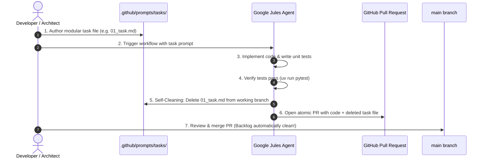

# Jules Task Delegation & Self-Cleaning Lifecycle Pattern

## 1. Overview & Objectives

As the CNCF Landscape A-to-Z project evolves, engineering tasks and content enrichment tasks are frequently delegated to **Google Jules** (and other autonomous coding agents). 

To ensure high implementation quality, avoid giant unreviewable pull requests, and maintain a spotless repository backlog, this repository adopts the **Atomic Task Delegation & Self-Cleaning Lifecycle Pattern**.



---

## 2. Directory Structure: `.github/prompts/tasks/`

Atomic tasks waiting for agent implementation are stored sequentially under `.github/prompts/tasks/`:

```
.github/prompts/
├── jules_prompt.md                       # Standing daily content prompt
├── content_manager.md                    # Role prompt for content orchestration
├── researcher.md                         # Role prompt for project research
├── writer.md                             # Role prompt for weekly posts
└── tasks/                                # 🎯 Modular Task Queue
    ├── 01_text_normalizer_utility.md
    ├── 02_pydantic_models_and_editorial_lock.md
    ├── 03_deterministic_grounding_validator.md
    └── 04_tool_card_projection_and_dag.md
```

---

## 3. The 4 Principles of Jules Task Authoring

Every task file in `.github/prompts/tasks/` must follow these four core principles:

### 1. Single Responsibility & Atomic Scope
* Each task should modify or introduce **1 core component/module** accompanied by **unit tests**.
* Avoid multi-system refactors in a single task.

### 2. Explicit Technical Contracts
* Provide exact function signatures, Pydantic field schemas, and error-handling requirements.
* Reference relevant architectural docs in `docs/` so the agent has full context.

### 3. Verifiable Definition of Done
* Specify exact test commands (e.g. `uv run pytest tests/test_text_normalizer.py`).
* All existing tests in the suite must pass without regressions.

### 4. Mandatory Self-Cleaning Final Step
* Every task must instruct the agent to **delete its own prompt file** as the final step before committing.
* This ensures that when the PR merges into `main`, the task is automatically removed from the backlog without human intervention or leftover ghost files.

---

## 4. Standard Task File Template

When authoring a new task for Jules, use this standard template:

```markdown
# Task <XX>: <Concise Title>

## Objective
<1-2 sentences describing what needs to be built and why.>

---

## Technical Specifications
### 1. File: <path/to/file.py>
<Exact class, function, or model signatures.>

### 2. File: <tests/test_file.py>
<Required test assertions and edge-case coverage.>

---

## Execution Steps for Jules
1. Implement <file.py>.
2. Implement unit tests in <test_file.py>.
3. Run verification: `uv run pytest <test_file.py>`.
4. **Self-Cleaning Step (Required)**: Delete this task file (`.github/prompts/tasks/<task_name>.md`) before creating the commit/PR.

---

## Definition of Done
- Implementation complete and adheres to architectural guidelines.
- 100% of test suite passes cleanly.
- Task prompt file deleted in the resulting PR.
```

---

## 5. How to Dispatch Tasks to Jules

Once task prompt files are committed and ready, dispatch them to Jules using either method:

### Option A: Via GitHub CLI (`gh`)
```bash
# Run Task 01
gh workflow run jules_schedule.yml \
  -f custom_prompt="$(cat .github/prompts/tasks/01_text_normalizer_utility.md)"
```

### Option B: Via GitHub Actions UI
1. Navigate to **Actions** $\rightarrow$ **Scheduled Jules Content Task** (`.github/workflows/jules_schedule.yml`).
2. Click **Run workflow**.
3. In the `custom_prompt` text area, paste the contents of the target task markdown file.
4. Click **Run workflow**.

---

## 6. Current Task Queue

| Task ID | Component | File Targets | Status |
|---|---|---|---|
| **Task 01** | Text Normalization Utility | `src/utils/text_normalizer.py`<br>`tests/test_text_normalizer.py` | ⏳ Ready for Dispatch |
| **Task 02** | Source Evidence & Editorial Lock | `src/agentic/models.py`<br>`src/tracker/yaml_backend.py` | ⏳ Ready for Dispatch |
| **Task 03** | Deterministic Grounding Validator | `scripts/validate_grounding.py`<br>`tests/test_grounding_validator.py` | ⏳ Ready for Dispatch |
| **Task 04** | Tool Card Projection & DAG Order | `src/agentic/projections.py`<br>`src/tracker/yaml_backend.py` | ⏳ Ready for Dispatch |
