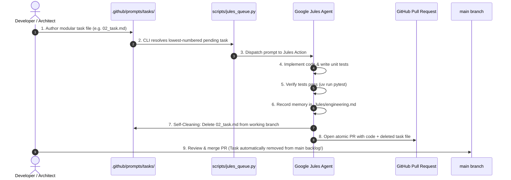

# Jules Task Delegation & Self-Cleaning Lifecycle Pattern

## 1. Overview & Objectives

As the CNCF Landscape A-to-Z project evolves, engineering tasks and content enrichment tasks are frequently delegated to **Google Jules** (and other autonomous coding agents). 

To ensure high implementation quality, avoid giant unreviewable pull requests, and maintain a spotless repository backlog, this repository adopts the **Atomic Task Delegation & Self-Cleaning Lifecycle Pattern**.



---

## 2. Agent Domain Memory (`.Jules/`)

To preserve architectural insights across independent agent sessions, agent learnings are persisted in domain-specific memory logs under `.Jules/`:

| File | Agent Domain | Scope & Topics |
|---|---|---|
| **`.Jules/palette.md`** | UI / Frontend | Layouts, Tailwind classes, accessibility semantics (`tabindex`, `focus-visible`), Hugo templates |
| **`.Jules/content.md`** | Content & Research | CNCF project discovery, release notes quirks, quote grounding rules |
| **`.Jules/engineering.md`** | Codebase Engineering | Pydantic schemas, CLI validators, YAML trackers, DAG projections, pytest suites |

Every memory entry follows this standardized format:
```markdown
## YYYY-MM-DD - <Topic Title>
**Learning:** <Insight or quirk discovered during the task>
**Action:** <Canonical pattern to apply in all future work>
```

---

## 3. Directory Structure: `.github/prompts/tasks/`

Atomic tasks waiting for agent implementation are stored sequentially under `.github/prompts/tasks/`:

```
.github/
├── actions/
│   └── prepare-jules-task/action.yml     # Composite Action for prompt resolution
├── prompts/
│   ├── jules_prompt.md                   # Standing daily content prompt
│   ├── content_manager.md                # Role prompt for content orchestration
│   ├── researcher.md                     # Role prompt for project research
│   ├── writer.md                         # Role prompt for weekly posts
│   └── tasks/                            # 🎯 Modular Task Queue (FIFO)
│       ├── 02_pydantic_models_and_editorial_lock.md
│       ├── 03_deterministic_grounding_validator.md
│       └── 04_tool_card_projection_and_dag.md
└── workflows/
    └── jules_schedule.yml                # Declarative scheduled & manual workflow
```

---

## 4. Local Task Queue CLI (`scripts/jules_queue.py`)

All task inspection, schema validation, and prompt resolution is fully encapsulated in `scripts/jules_queue.py` and can be executed locally without depending on GitHub Actions:

```bash
# List all pending tasks in deterministic numeric order
uv run python scripts/jules_queue.py list

# Validate all task files against required structural contracts
uv run python scripts/jules_queue.py validate

# Inspect the prompt that would be dispatched to Jules
uv run python scripts/jules_queue.py get-prompt --info
```

---

## 5. The 5 Principles of Jules Task Authoring

Every task file in `.github/prompts/tasks/` must follow these core principles:

### 1. Single Responsibility & Atomic Scope
* Each task modifies or introduces **1 core component/module** accompanied by **unit tests**.
* Avoid multi-system refactors in a single task.

### 2. Explicit Technical Contracts
* Provide exact function signatures, Pydantic field schemas, and error-handling requirements.
* Reference relevant architectural docs in `docs/` for context.

### 3. Verifiable Definition of Done
* Specify exact test commands (e.g. `uv run pytest tests/test_text_normalizer.py`).
* All existing tests in the suite must pass without regressions.

### 4. Memory Recording (`.Jules/engineering.md`)
* Instruct the agent to record any architectural lessons or schema quirks in `.Jules/engineering.md`.

### 5. Mandatory Self-Cleaning Final Step
* Every task must instruct the agent to **delete its own prompt file** as the final step before committing.
* When the PR merges into `main`, the task is automatically removed from the backlog on `main`.

---

## 6. Standard Task File Template

When authoring a new task for Jules, use this standard template:

```markdown
# Task <XX>: <Concise Title>

## Objective
<1-2 sentences describing what needs to be built and why.>

---

## Technical Specifications
### 1. File: <path/to/file.py>
<Exact class, function, or model signatures.>

### 2. File: <tests/test_file.py>
<Required test assertions and edge-case coverage.>

---

## Execution Steps for Jules
1. Implement <file.py>.
2. Implement unit tests in <test_file.py>.
3. Run verification: `uv run pytest <test_file.py>`.
4. **Record Learnings (Required)**: Append any architectural insights or edge cases to `.Jules/engineering.md`.
5. **Self-Cleaning Step (Required)**: Delete this task file (`.github/prompts/tasks/<task_name>.md`) before creating the commit/PR.

---

## Definition of Done
- Implementation complete and adheres to architectural guidelines.
- 100% of test suite passes cleanly.
- Architectural learnings recorded in `.Jules/engineering.md`.
- Task prompt file deleted in the resulting PR.
```

---

## 7. Current Task Queue

| Task ID | Component | File Targets | Status |
|---|---|---|---|
| **Task 01** | Text Normalization Utility | `src/utils/text_normalizer.py`<br>`tests/test_text_normalizer.py` | ✅ Completed & Merged (PR #150) |
| **Task 02** | Source Evidence & Editorial Lock | `src/agentic/models.py`<br>`src/tracker/yaml_backend.py` | ⏳ Ready in Queue |
| **Task 03** | Deterministic Grounding Validator | `scripts/validate_grounding.py`<br>`tests/test_grounding_validator.py` | ⏳ Queued |
| **Task 04** | Tool Card Projection & DAG Order | `src/agentic/projections.py`<br>`src/tracker/yaml_backend.py` | ⏳ Queued |

