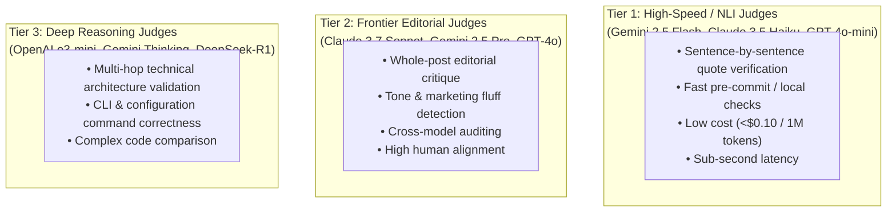

# Model Capabilities & LLM Judge Design Guide

## 1. Overview & Objectives

This document establishes the technical blueprint for building automated **LLM-as-a-Judge**, **Critic**, and **Evaluation** agents in the CNCF Landscape A-to-Z project. 

The primary goal is to ensure high editorial standards, factual grounding, and consistent voice across hundreds of open-source project summaries without incurring excessive API latency or cost.

---

## 2. Taxonomy of Judges & Evaluation Tasks

The content pipeline requires five distinct evaluation capabilities:

| Judge Type | Scope / Responsibility | Input $\rightarrow$ Output | Evaluation Complexity | Primary Model Tier |
|---|---|---|---|---|
| **1. Quote Entailment Judge (NLI)** | Validates that synthesized bullet points are strictly entailed by cited research quotes. | `(Quote, Claim)` $\rightarrow$ `ENTAILED / EXTRAPOLATED / CONTRADICTION` | Low–Medium (Semantic NLI) | **Tier 1 (Flash / Small)** |
| **2. Hallucination & Drift Critic** | Detects facts or capabilities introduced from parametric memory that lack source attribution. | `(Research Notes, Draft Post)` $\rightarrow$ `List[UncitedClaims]` | Medium–High (Needle in haystack) | **Tier 2 (Frontier / Mid)** |
| **3. Editorial Tone & Style Evaluator** | Grades voice (objective, technical, discovery-focused, no marketing fluff or hyperbolic adjectives). | `(Draft Post, Style Rubric)` $\rightarrow$ `Score + Suggestions` | Medium (Subjective alignment) | **Tier 2 (Frontier / Mid)** |
| **4. Structural & Contract Linter** | Validates YAML schemas, Hugo frontmatter, link HTTP statuses, and markdown hierarchies. | `(Raw Files)` $\rightarrow$ `PASS / FAIL + Error` | Zero (Deterministic) | **Python / Regex / AST** |
| **5. Pairwise Ranking Judge** | Evaluates two revision drafts to determine which best meets editorial goals. | `(Draft A, Draft B, Rubric)` $\rightarrow$ `Winner + Rationale` | High (Comparative reasoning) | **Tier 2 / Tier 3** |

---

## 3. Model Capability Tiers & Selection Matrix



### 3.1 Tier Comparison Matrix

| Model Tier | Representative Models | Strengths | Limitations | Best Suited For |
|---|---|---|---|---|
| **Tier 1 (High-Speed)** | `gemini-2.5-flash`, `claude-3-5-haiku`, `gpt-4o-mini` | • Ultra-low cost<br>• <500ms latency<br>• Strict JSON schema adherence | • Susceptible to leniency bias on subtle marketing fluff<br>• Weaker on multi-document reasoning | High-throughput binary NLI quote checks for every project feature. |
| **Tier 2 (Frontier)** | `claude-3-7-sonnet`, `gemini-2.5-pro`, `gpt-4o` | • Highest human editorial alignment<br>• Catches nuanced technical hand-waving<br>• Strong stylistic critique | • 10x–20x higher cost<br>• Slower response time | Weekly blog post review, PR-level editorial health audit. |
| **Tier 3 (Deep Reasoning)** | `o3-mini`, `gemini-2.5-flash-thinking`, `deepseek-r1` | • Uncompromising multi-step logical verification<br>• Validates installation commands against Kubernetes versions | • Variable reasoning latency<br>• Output requires structured extraction | Deep-dive verification for complex infrastructure projects. |
| **Deterministic** | Python regex, `requests.head`, AST parsers | • 100% deterministic<br>• Zero token cost<br>• Instant | • Cannot evaluate semantic meaning | Link validation, date checks, release tag verification against GitHub API. |

---

## 4. Bias Mitigation Strategies for LLM Judges

LLM judges are subject to specific cognitive and structural biases. The evaluation framework must implement these safeguards:

| Bias Type | Manifestation | Mitigation Strategy |
|---|---|---|
| **Self-Enhancement Bias** | Models systematically assign higher scores to text generated by their own model family. | **Cross-Model Auditing**: Use Claude to judge Gemini drafts, or vice versa. |
| **Verbosity Bias** | Judges equate longer, wordier summaries with higher quality and completeness. | **Explicit Rubric Penalty**: Include negative scoring rules for unnecessary filler, buzzwords, and fluff. |
| **Position Bias** | In pairwise comparisons (Draft A vs Draft B), models favor Candidate A. | **Order Swapping**: Run evaluations twice (A vs B and B vs A) and require consistent preference. |
| **Premature Verdict Bias** | Model outputs `PASS` before conducting detailed token-by-token comparison. | **Rationale-First Schema**: Enforce that reasoning and evidence fields are emitted *before* the verdict enum. |

---

## 5. Implementation Blueprints

### 5.1 Rationale-First Entailment Judge Schema

```python
from pydantic import BaseModel, Field
from enum import Enum
from typing import List

class EntailmentVerdict(str, Enum):
    ENTAILED = "entailed"         # Claim is 100% supported by the cited quote
    EXTRAPOLATED = "extrapolated" # Claim adds unverified facts not in quote
    CONTRADICTION = "contradiction" # Claim conflicts with the quote

class QuoteEntailmentJudgeOutput(BaseModel):
    claim_text: str = Field(description="The specific assertion being evaluated")
    cited_quote: str = Field(description="The source quote provided as evidence")
    
    # 1. Step-by-step reasoning MUST be emitted first
    evidence_analysis: str = Field(
        description="Step-by-step analysis comparing the factual claims against the quote text"
    )
    unsupported_elements: List[str] = Field(
        description="Specific words or facts asserted in the claim that are absent in the quote",
        default_factory=list
    )
    
    # 2. Final verdict emitted last
    verdict: EntailmentVerdict
    confidence: float = Field(ge=0.0, le=1.0, description="Confidence in the verdict")
```

### 5.2 Two-Stage Cascading Judge Architecture

```
[ Research Note & Tool Page Draft ]
                 │
                 ▼
┌────────────────────────────────────────────────────────┐
│ STAGE 1: Deterministic & Tier 1 Flash Judge            │
│ • Python: Verbatim substring check in fetched source   │
│ • GitHub API: Release tag & date verification          │
│ • Gemini 2.5 Flash: Granular quote entailment check    │
└───────────────────────────┬────────────────────────────┘
                            │
              ┌─────────────┴─────────────┐
              ▼                           ▼
        [ 100% Pass ]             [ Flagged / Low Score ]
              │                           │
              │                           ▼
              │             ┌────────────────────────────┐
              │             │ STAGE 2: Frontier Critic   │
              │             │ (Claude 3.7 / Gemini Pro)  │
              │             │ • Whole-post review        │
              │             │ • Prescribes exact edits   │
              │             └─────────────┬──────────────┘
              │                           │
              ▼                           ▼
   [ Automated Green CI ]       [ PR Editorial Health Report ]
```

---

## 6. Action Items for Future Sessions

When implementing the evaluation framework in subsequent sessions, follow this roadmap:

- [ ] **Step 1: Build Deterministic Grounding Validators**:
  - Implement substring quote validation against cached scrape payloads.
  - Implement GitHub REST API check for `latest_release` tags and dates.
- [ ] **Step 2: Implement Tier 1 Flash Entailment Judge**:
  - Create a lightweight NLI evaluation prompt using `gemini-2.5-flash` with the `QuoteEntailmentJudgeOutput` schema.
  - Integrate into `tests/test_grounding_eval.py`.
- [ ] **Step 3: Implement Tier 2 Editorial Critic**:
  - Create an editorial style and anti-fluff judge for weekly blog posts.
  - Add PR bot reporting in GitHub Actions to comment editorial health summaries.
