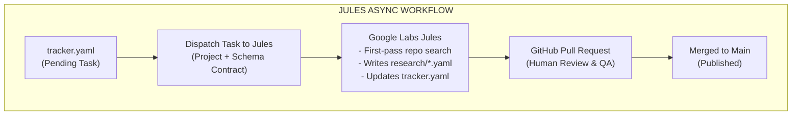

I like to put every AI coding tool to work regardless of the task—especially tools I don't use day-to-day at work, just so I can gain a broader view of the ecosystem.

If you use Gemini, you have free access to **Google Labs Jules** with a generous limit of **100 tasks per day**. That's significantly more than my GitHub Copilot subscription, which these days is mostly consumed by PR reviews anyway. Every AI agent has its role, and for a massive project like **CNCF Landscape A-to-Z**, there is plenty of work to distribute. While I build and test persistent agents with Pydantic AI or run coding agents via custom skills, paid API quotas shouldn't be wasted on basic repository chores when free included tiers are available.

The turning point came with the recent release of the **Jules GitHub Action**. It triggered an interesting idea: *What if tasks could be defined as Markdown files right inside the repository, and Jules could complete them automatically on a schedule?* Considering GitHub Action schedule limits, that allows up to 3 automated background tasks completed every day.

This article is your guide to discovering Jules and learning how to leverage it in a completely headless workflow—turning it into an automated second Copilot contributor for your GitHub repositories.

---

## What is Jules? (by Jules)

**Jules** is an experimental asynchronous coding agent developed by Google Labs. Unlike synchronous chat interfaces or inline code-completion extensions (like GitHub Copilot or Cursor) that require an engineer to stay in the loop during generation, Jules is designed to work autonomously in the background directly against your GitHub repositories.

When you dispatch a task to Jules—whether via a scheduled job, a prompt, or an issue—it:
1. Clones your repository and inspects the codebase.
2. Develops a multi-step plan to solve the prompt or task description.
3. Makes necessary file edits, runs scripts, or structures data.
4. Commits the changes under `google-labs-jules[bot]` on a dedicated branch.
5. Opens a clean Pull Request with a summary of its changes for human review.

This asynchronous model shifts the human role from **prompt writer** to **code reviewer**. Instead of waiting for tokens to stream into a terminal, you queue tasks and review ready-to-merge pull requests whenever you are ready.

---

## What Can Jules Do? 

When you first open Google Labs Jules as you would expect, the interface offers a few built-in ways to interact with your codebase, 

The most obvious starting point is simply opening the Jules web interface and launching a session with a prompt:


While handy for quick one-off edits, my main issue with ad-hoc sessions is that it's *just yet another chat UI*. What I really wanted was a way to plan tasks using one agent, stage those tasks inside the repo, and let Jules pick them up asynchronously over time.


Jules also lets you run tasks on a schedule using predefined templates for Performance, Design, and Security (like "Bolt," a performance-obsessed persona):


I used scheduled tasks for a while, but ran into a fundamental limitation: the prompt has to be fairly generic. Pointing Jules at a repository and asking it to autonomously hunt for general optimizations or initiate tool research felt too broad. I realized I could get far better results if I could template the prompt itself—defining both the exact action and the trigger.


Another feature in the UI is **Suggestions**, where Jules automatically scans your repository and recommends fixes:


Surprisingly, these suggestions are often remarkably spot-on at catching bottlenecks and redundant code patterns. (Even though, ironically, half of the flagged issues were bad code proactively introduced by Jules in earlier PRs! But hey, at least things improve over time.)

---

## The Breakthrough: "Tasks as Code" and the GitHub Action

One day, I spotted in my news feed the **Jules GitHub Action**. It felt like a dream come true. I had previously tinkered with the Jules API trying to turn it into an MCP server for my local agent setup, but the native GitHub Action was so much cleaner.

It unlocked a core concept for me: **Task as Code for Jules**. 

Something not too far from spec-driven development—I could probably use both combined, but in this specific case we want to leverage Jules for more than code. Could Jules create its own tasks? Most likely! That would be an interesting experiment (an infinite loop of tasks, so long as I approve and merge the PRs fast enough).

I think we don't need a bloated ticket tracker or task board to manage AI agents. Boards like Jira and Linear have become a jungle of AI-written tickets for AI by AI that only bother managers checking what gets closed in hopes of seeing some progress in milestones.

The concept is simple: tasks are just Markdown or YAML files checked into git. You build the prompt right into the task file, stage it in your repository, and let GitHub Actions trigger Jules to complete it automatically.

---

## Let's Dive In: Tasks as Code in GitHub Actions

The first thing I tried was replacing the web UI altogether. I hated that my prompts weren't versioned and were a pain to manage in a web GUI. Asking Gemini to write a prompt and then manually copy-pasting it into Jules's web modal makes no sense.

Keeping prompts in git is a complete game changer. Instead of pasting prompts into web forms, we store them directly in the repository as versioned Markdown files (like `.github/prompts/weekly_optimization.md`):

```markdown
# Weekly Code Optimization Task

You are an automated performance engineer assigned to optimize the repository `mekitmedia/cncf-landscape-a-to-z`.

## Guidelines
- Inspect `src/` and `website/` for inefficient file I/O operations, redundant loop traversals, or un-cached static reads.
- Identify ONE small, high-impact performance bottleneck.
- Implement the fix while preserving unit tests and existing function signatures.
- Do NOT introduce new heavy dependencies.
```

We then trigger this versioned prompt via a simple cron GitHub Action (`.github/workflows/scheduled_optimization.yml`):

```yaml
name: Weekly Jules Optimization Task

on:
  schedule:
    - cron: '0 8 * * 1' # Every Monday at 8:00 AM
  workflow_dispatch:

jobs:
  optimize:
    runs-on: ubuntu-latest
    steps:
      - name: Checkout repository
        uses: actions/checkout@v4

      - name: Read Versioned Prompt
        id: read-prompt
        run: |
          PROMPT=$(cat .github/prompts/weekly_optimization.md)
          echo "prompt<<EOF" >> $GITHUB_OUTPUT
          echo "$PROMPT" >> $GITHUB_OUTPUT
          echo "EOF" >> $GITHUB_OUTPUT

      - name: Dispatch Task to Jules
        uses: google-labs/jules-action@v1
        with:
          jules-token: ${{ secrets.JULES_API_TOKEN }}
          prompt: ${{ steps.read-prompt.outputs.prompt }}
```

Because the prompt lives in git, anyone on the team can submit a PR to improve the agent's instructions. A real example of this pattern in action was [PR #73](https://github.com/mekitmedia/cncf-landscape-a-to-z/pull/73), where Jules picked up a performance task, diagnosed an N+1 filesystem bottleneck in `tool_pages.py`, introduced in-memory caching, and sped up page generation without breaking tests.

Next, I wanted a way to queue up a sequence of ad-hoc tasks without needing complex infrastructure—a little bit of Python scripting or a simple CLI is more than enough.

The idea is straightforward: create a `.github/tasks/` folder where files are named sequentially (`00-task.md`, `01-task.md`, `02-task.md`). When the workflow runs, it takes the first file in the folder (`00-task.md`), sends its prompt to Jules, and explicitly instructs Jules to delete that task file in its generated PR. That way, once the PR is merged, the next run automatically picks up `01-task.md`.

Is there a risk that Jules might run the same task twice if runs overlap? Yes, but honestly, who cares? Worst case, I lose one free session and close the duplicate PR. It's not worth building a complex locking system for at this point (though I have a few ideas on using the GitHub API to orchestrate the UI via workflows—I'll only tackle that if it actually becomes an issue).

Then comes the actual workflow that really matters to me: the project tracker for **CNCF Landscape A-to-Z**.

This tracker ([`data/tracker.yaml`](https://github.com/mekitmedia/cncf-landscape-a-to-z/blob/main/data/tracker.yaml)) wasn't built just for Jules—it was built for *any* agent (Pydantic AI, custom scripts, or Jules) to work together, pick a task, execute it, and report results:

```yaml
week: 12
projects:
  - name: "Akri"
    status: "pending"
    category: "Edge Computing"
  - name: "Atlantis"
    status: "completed"
    category: "GitOps"
  - name: "Athenz"
    status: "pending"
    category: "Security"
```

To keep our GitHub Action workflow clean, I built a custom action: [`prepare-jules-task`](https://github.com/mekitmedia/cncf-landscape-a-to-z/blob/main/.github/actions/prepare-jules-task/action.yml). It queries `tracker.yaml`, picks a pending task, and formats the prompt.

Here's how I handle concurrency: I don't bother with lock systems—I just use randomness. When processing 900+ tools across the CNCF landscape, the probability of two agents randomly selecting the exact same project on concurrent runs is practically zero:

```yaml
name: Scheduled Jules Project Research

on:
  schedule:
    - cron: '0 9 * * 1-5' # Mon-Fri at 9 AM
  workflow_dispatch:

jobs:
  scheduled-jules:
    runs-on: ubuntu-latest
    steps:
      - name: Checkout repository
        uses: actions/checkout@v4

      - name: Prepare Jules Task
        id: prepare
        uses: ./.github/actions/prepare-jules-task
        with:
          tracker_path: "data/tracker.yaml"

      - name: Dispatch to Jules
        if: steps.prepare.outputs.has_task == 'true'
        uses: google-labs/jules-action@v1
        with:
          jules-token: ${{ secrets.JULES_API_TOKEN }}
          prompt: ${{ steps.prepare.outputs.prompt }}
```

When Jules finishes, the PR arrives with both the generated research YAML (like [PR #116 for Akri](https://github.com/mekitmedia/cncf-landscape-a-to-z/pull/116) or [PR #114 for Atlantis](https://github.com/mekitmedia/cncf-landscape-a-to-z/pull/114)) and the updated `tracker.yaml` state. One click to merge, and both state and content are synchronized:



---

## Wrapping Up: Jules is Just Another Agent

I really like the direction this setup is going. Moving away from proprietary dashboards so that *everything is just files in git* is great, especially when running completely headless in GitHub Actions.

That said, I'm still not sure I would give Jules very large, complicated tasks without tight constraints. At the end of the day, Jules is just another agent in the toolbox—and I treat it as such. In our workflow, Jules actually uses mostly the same prompt contracts as all my other agents, whether they're local coding CLI tools or multi-agent pipelines orchestrated with Pydantic AI.

In the future, I'd love to compare how each of these different workflows and harnesses perform against the exact same tasks—but that's a story and a project for another time.

Have you tried using asynchronous agents like Jules in your repositories? Let me know your thoughts and favorite setups!
